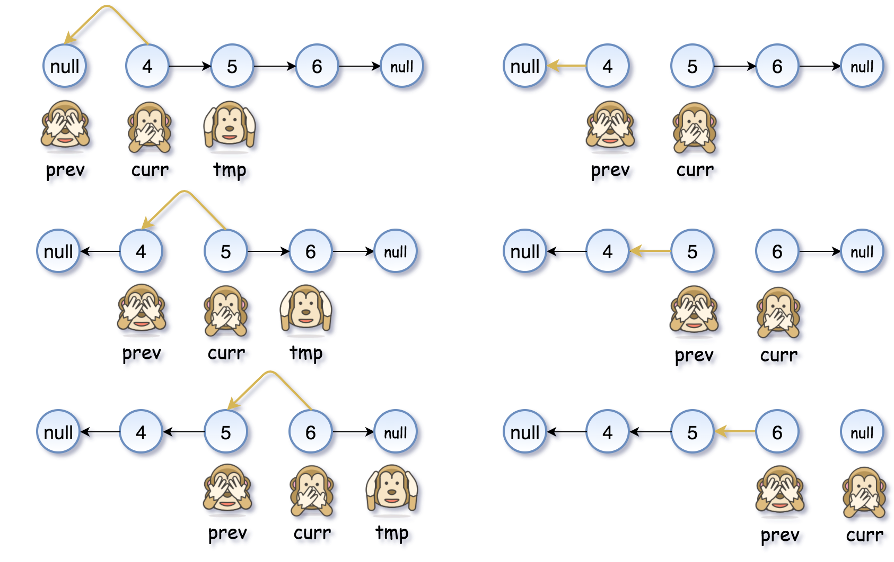

# Reverse Linked List

https://leetcode.com/problems/reverse-linked-list/

https://youtu.be/G0_I-ZF0S38

### Algorithm
Approach: two pointers

While you're moving along the list, change the node's next pointer to point to the previous node: curr.next = prev, and shift the current node to the right for the next iteration: prev = curr, curr = tmp.

### Time complexity
O(n).

### Space complexity
O(1).

