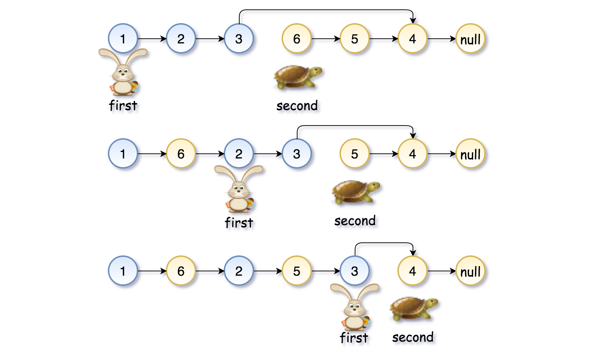

# Merge Two Sorted Lists

https://leetcode.com/problems/merge-two-sorted-lists/

https://youtu.be/XIdigk956u0

### Algorithm
Approach: two pointers

This algorithm is similar to the one for list reversal.

Let's pick the first node of each list - first and second, and save their successors. While you're traversing the list, set the first node's next pointer to point to the second node, and the second node's next pointer to point to the successor of the first node. For this iteration the job is done, and for the next iteration move to the previously saved nodes' successors.

