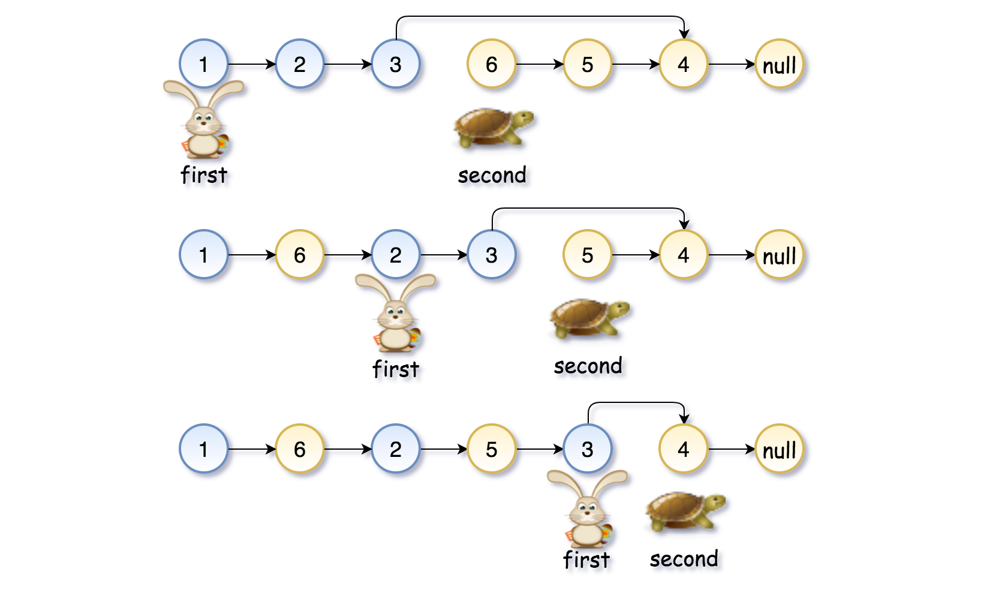

# Merge Two Sorted Lists

https://leetcode.com/problems/merge-two-sorted-lists/

https://youtu.be/XIdigk956u0

### Algorithm
Approach: two pointers, dummy node

1) We create a dummy node to handle the edge case of the first node.
2) We init a pointer that will track the current position
3) We iterate over both lists until they are not empty
4) We compare the items in each list, we take the smallest one and add to the result and move a pointer forward in the list that had the smallest item.
5) When one of the lists is empty, the second one might still have values, so we copy them to the result (we just point the next item of the current item to the not empty list)
6) We return dummy's pointer to the next item

