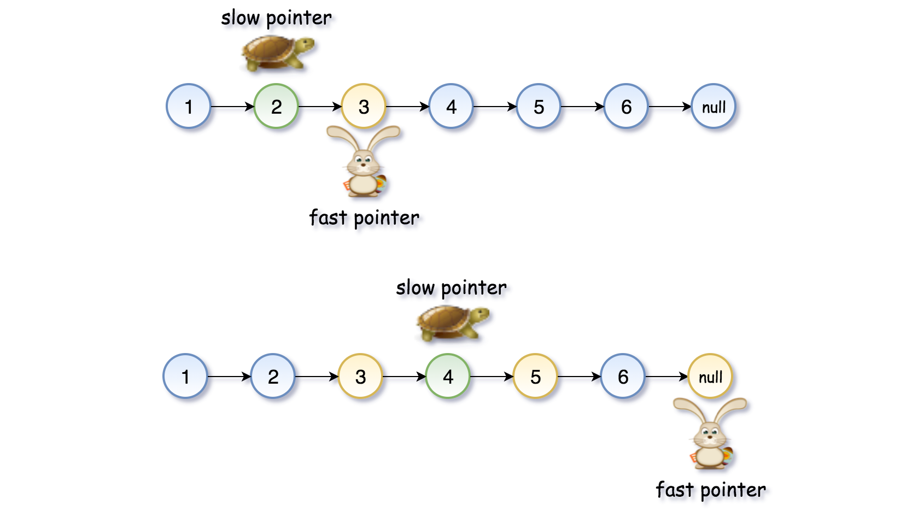

# Middle of the Linked List

https://leetcode.com/problems/middle-of-the-linked-list/

### Algorithm

1) Let's use two pointers, slow and fast. 
2) While the slow pointer moves one step forward slow = slow.next, the fast pointer moves two steps forward fast = fast.next.next, i.e. fast traverses twice as fast as slow. 
3) When the fast pointer reaches the end of the list, the slow pointer should be in the middle.

