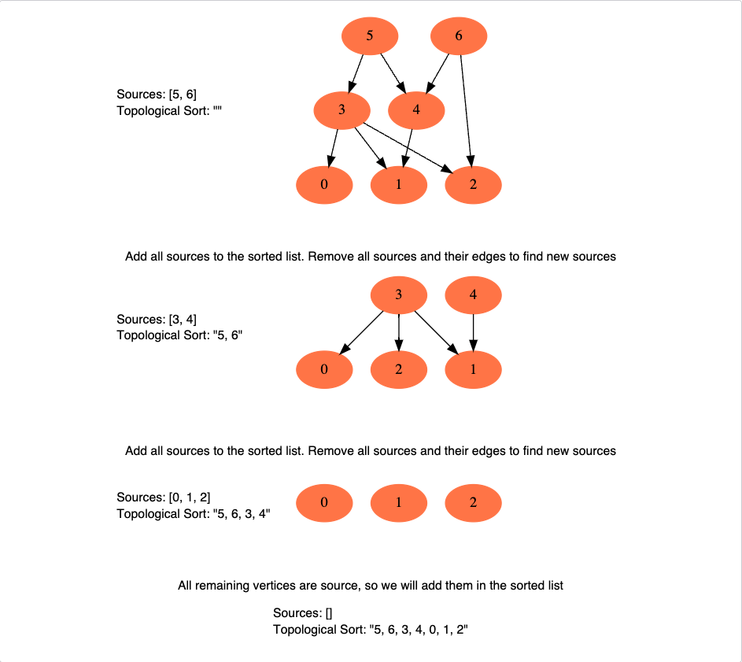

# Course Schedule

https://leetcode.com/problems/course-schedule/

### Algorithm
Approach: graph topological sort

This is how we can implement this algorithm:

* **Initialization** - We will store the graph in Adjacency Lists, which means each parent vertex will have a list containing all of its children. We will do this using a HashMap where the ‘key’ will be the parent vertex number and the value will be a List containing children vertices. To find the sources, we will keep a HashMap to count the in-degrees i.e., count of incoming edges of each vertex. Any vertex with ‘0’ in-degree will be a source.
* **Build the graph and find in-degrees of all vertices** - We will build the graph from the input and populate the in-degrees HashMap.
* **Find all sources** - All vertices with ‘0’ in-degrees will be our sources and we will store them in a Queue.
* **Sort** - For each source, do the following things:
  1. Add it to the sorted list.
  2. Get all of its children from the graph.
  3. Decrement the in-degree of each child by 1.
  4. If a child’s in-degree becomes ‘0’, add it to the sources Queue.
  5. Repeat step 1, until the source Queue is empty.
* **Return** - If the sorted list do contain all the elements from the graph it means that we managed to topologicaly sort the graph, so we return true, if not, it means there us a cycle and we return false. 

